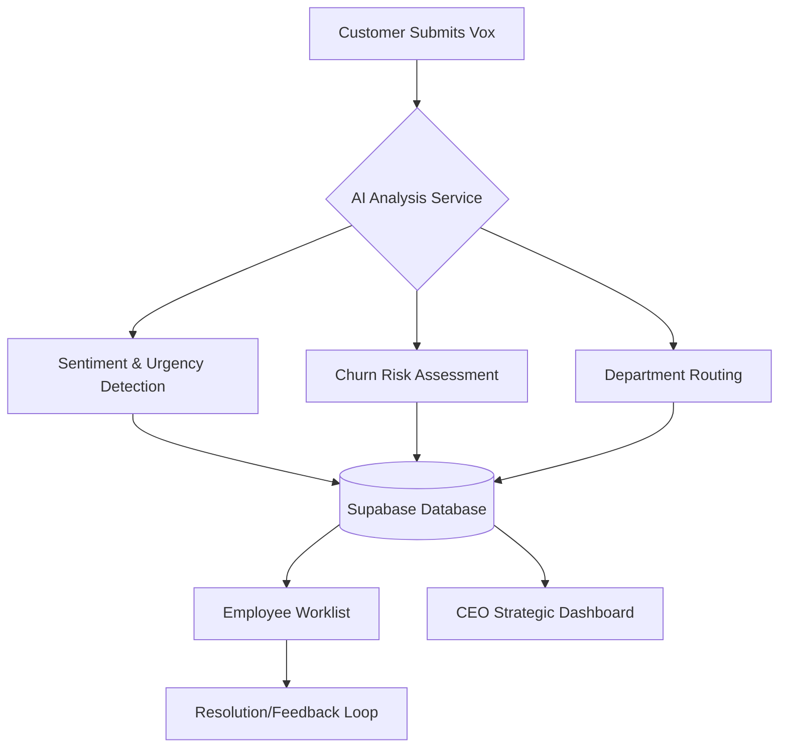
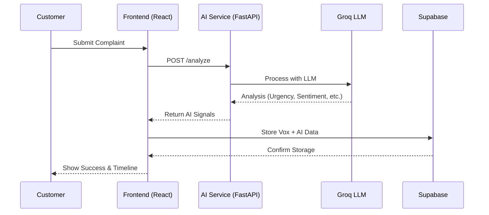
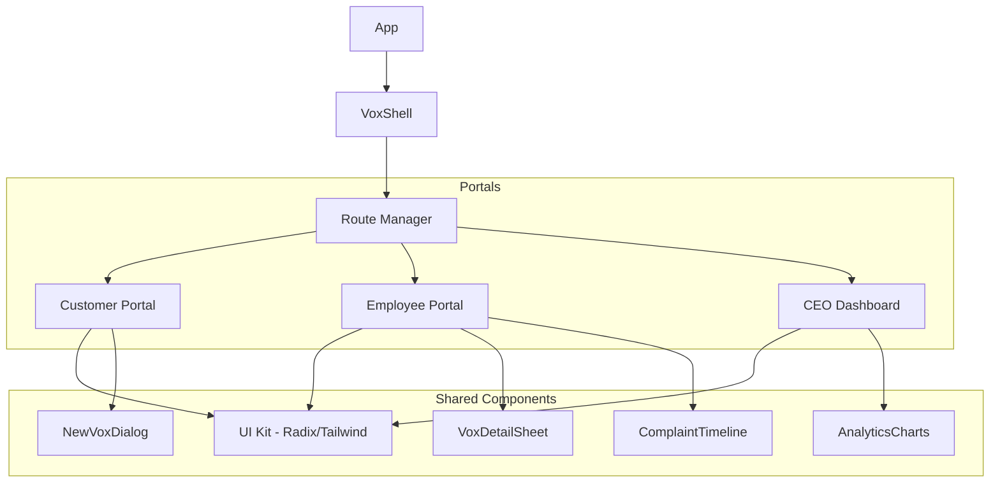

# Vox: AI-Powered Customer Complaint Intelligence System (CCIS)


## 📌 Overview
**Vox** is a premium, full-stack Management Information System (MIS) designed to streamline customer complaint management through Artificial Intelligence. It transforms raw customer feedback into actionable strategic insights using state-of-the-art LLMs, providing tailored experiences for Customers, Employees, and Executives.

---

## 🚀 Key Features

### 👤 Customer Portal
- **Intelligent Submission**: AI-assisted complaint filing with real-time suggestions.
- **Visual Tracking**: Progress timeline for every "Vox" (complaint).
- **Multi-modal Support**: File uploads and rich text descriptions.

### 👷 Employee Portal
- **AI Triage**: Automated urgency detection, churn risk assessment, and sentiment analysis.
- **Smart Worklist**: Filterable and searchable dashboard for managing assigned tasks.
- **Action Center**: One-click resolution and escalation workflows.

### 📊 CEO Strategic Dashboard
- **Business Health Analytics**: High-level metrics on department performance and financial exposure.
- **Semantic Search**: Ask natural language questions about customer issues.
- **Strategic Briefing**: AI-generated reports on long-term trends and systemic risks.

---

## 🛠️ Technology Stack

| Layer | Technology |
|-------|------------|
| **Frontend** | React, Next.js, TanStack Router, Tailwind CSS |
| **Backend** | FastAPI (Python), Node.js (Server Functions) |
| **Database** | Supabase (PostgreSQL) |
| **AI/ML** | Groq (Llama 3/Mixtral), Semantic Embeddings |
| **Icons & UI** | Lucide-React, Framer Motion, Radix UI |

---

## 📐 Architecture & Workflow

### 🔄 System Workflow


### ⏱️ Sequence Diagram


### 🧩 Component Hierarchy (Task Diagram)


---

## 📦 All Components

### Core Vox Components (`src/components/vox`)
- **`VoxShell`**: The primary layout wrapper providing consistent navigation and branding.
- **`NewVoxDialog`**: Complex form handler with real-time AI suggestions during typing.
- **`VoxDetailSheet`**: Comprehensive side-panel for reviewing complaint details, AI signals, and history.
- **`ComplaintTimeline`**: Visual representation of the lifecycle of a complaint.
- **`VoxBadge` / `VoxButton` / `VoxInput`**: Custom-styled UI elements following the "Vox" design system.
- **`VoxCard`**: Summarized view of complaints used in worklists and dashboards.
- **`SuggestionCard`**: AI-driven suggestions displayed to users during complaint submission.

### UI Infrastructure (`src/components/ui`)
- Premium Radix-based components including Dialogs, Sheets, Tabs, and Data Tables, all customized with a sleek, dark-mode-first aesthetic.

---

## 📸 Screenshots

> [!TIP]
> Add your project screenshots to the `/docs/screenshots` folder and link them below.

| Customer Submission | Employee Dashboard | CEO Analytics |
|---------------------|--------------------|---------------|
|  |  |  |

---

## 🛠️ Setup & Installation

1. **Clone the repository**
   ```bash
   git clone <repo-url>
   cd mis-lab
   ```

2. **Install dependencies**
   ```bash
   npm install
   cd ai && pip install -r requirements.txt
   ```

3. **Configure Environment Variables**
   Create a `.env.local` in the root and an `.env` in the `/ai` directory with the following:
   - `NEXT_PUBLIC_SUPABASE_URL`
   - `NEXT_PUBLIC_SUPABASE_ANON_KEY`
   - `GROQ_API_KEY`

4. **Run the application**
   ```bash
   # Terminal 1: Frontend
   npm run dev

   # Terminal 2: AI Service
   cd ai
   python -m uvicorn main:app --reload
   ```

---

## 📄 License
This project was developed as part of the **MIS Lab Mini Project**. All rights reserved.
