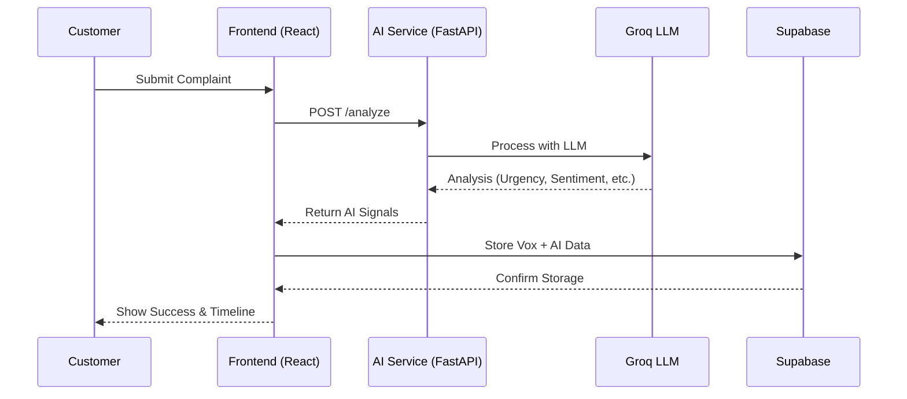
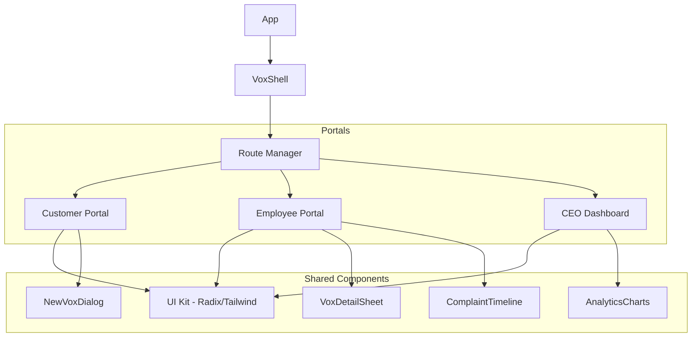

# MIS Lab Submission
**Name:** Chaitra Samant  
**Reg No:** 231070055  
**Batch:** MIS LAB Batch B  

---

# Vox: AI-Powered Customer Complaint Intelligence System (CCIS)

Vox is a comprehensive Management Information System (MIS) designed to modernize customer complaint management through Artificial Intelligence. By leveraging state-of-the-art Large Language Models (LLMs), Vox transforms unstructured customer feedback into actionable strategic insights, providing specialized interfaces for customers, employees, and executive leadership.

## Introduction

In modern enterprise environments, managing customer feedback at scale requires more than just a tracking system. Vox addresses this by integrating AI-driven analysis directly into the complaint lifecycle. The system automatically assesses sentiment, detects urgency, and routes issues to the appropriate departments, ensuring that critical problems are addressed with priority while providing executives with high-level trends and risk assessments.

## Core Features

### Customer Portal
*   **Intelligent Submission**: AI-assisted complaint filing with real-time feedback and suggestions.
*   **Status Tracking**: Comprehensive timeline view for monitoring the progress of submitted complaints.
*   **Multi-modal Support**: Capability to include file uploads and rich text descriptions for detailed reporting.

### Employee Portal
*   **Automated Triage**: AI-powered urgency detection, churn risk assessment, and sentiment analysis for incoming issues.
*   **Workflow Management**: Optimized dashboard for managing assigned tasks with advanced filtering and search capabilities.
*   **Action Center**: Integrated workflows for resolution, escalation, and internal communication.

### Executive Strategic Dashboard
*   **Business Intelligence**: High-level metrics focusing on departmental performance and financial exposure.
*   **Natural Language Analytics**: Semantic search capabilities allowing executives to query customer data using natural language.
*   **Strategic Reporting**: AI-generated briefings on long-term trends, systemic risks, and operational bottlenecks.

## Technology Stack

| Layer | Technology |
| :--- | :--- |
| **Frontend** | React, Next.js, TanStack Router, Tailwind CSS |
| **Backend** | FastAPI (Python), Node.js (Server Functions) |
| **Database** | Supabase (PostgreSQL) |
| **AI/ML** | Groq (Llama 3/Mixtral), Semantic Embeddings |
| **UI Components** | Lucide-React, Framer Motion, Radix UI |

## System Architecture

### System Workflow

```mermaid
graph TD
    A[Customer Submits Vox] --> B{AI Analysis Service}
    B --> C[Sentiment & Urgency Detection]
    B --> D[Churn Risk Assessment]
    B --> E[Department Routing]
    C & D & E --> F[(Supabase Database)]
    F --> G[Employee Worklist]
    F --> H[CEO Strategic Dashboard]
    G --> I[Resolution/Feedback Loop]
```


### Sequence Diagram


### Component Hierarchy


## Installation and Setup

### Prerequisites
*   Node.js (v18+)
*   Python 3.9+
*   Supabase Account

### Setup Steps

1.  **Clone the Repository**
    ```bash
    git clone <repo-url>
    cd mis-lab
    ```

2.  **Install Dependencies**
    ```bash
    npm install
    cd ai && pip install -r requirements.txt
    ```

3.  **Environment Configuration**
    Create a `.env.local` in the root directory and an `.env` in the `/ai` directory with the following variables:
    *   `NEXT_PUBLIC_SUPABASE_URL`
    *   `NEXT_PUBLIC_SUPABASE_ANON_KEY`
    *   `GROQ_API_KEY`

4.  **Run the Application**
    
    **Frontend Development Server:**
    ```bash
    npm run dev
    ```

    **AI Service:**
    ```bash
    cd ai
    python -m uvicorn main:app --reload
    ```


