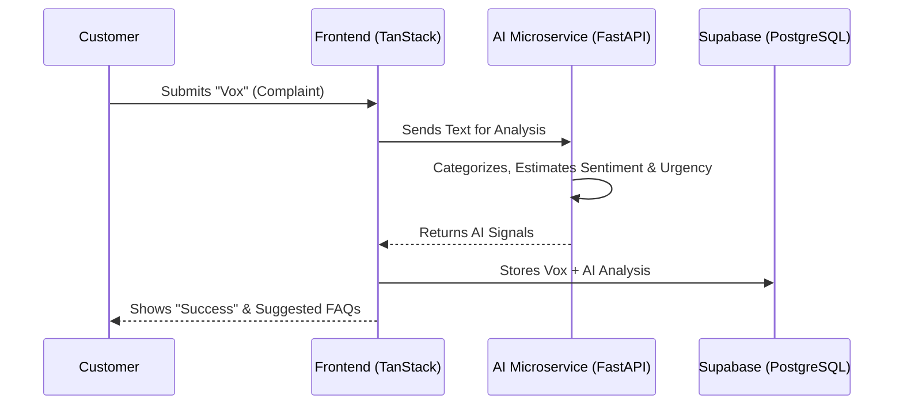
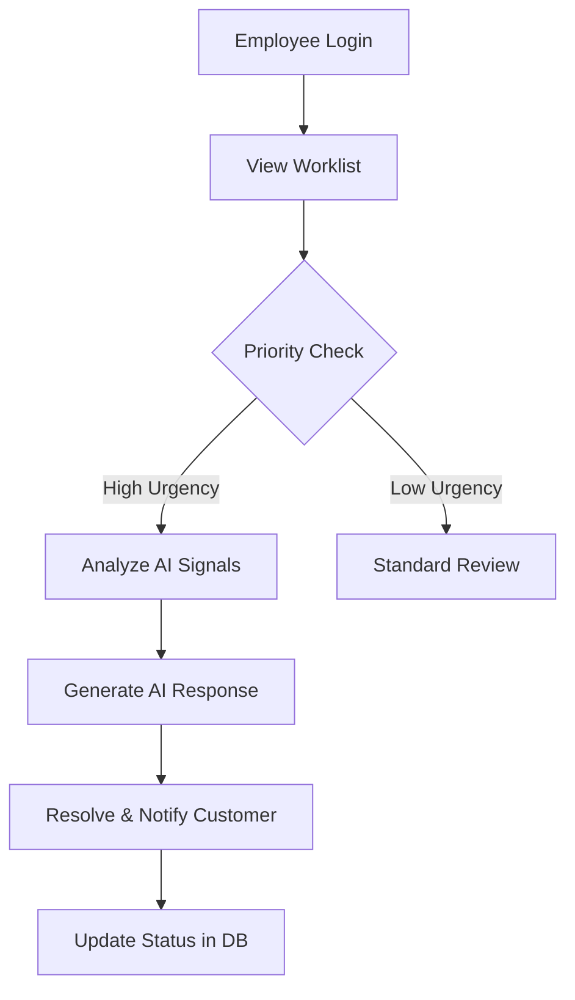
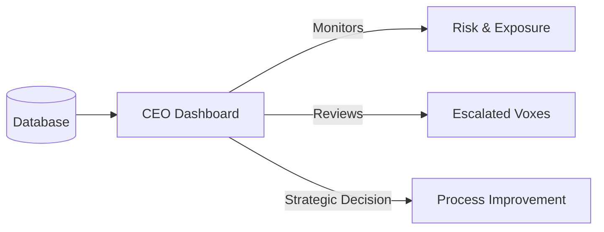

# Vox: AI-Powered CCIS for AuraBank

## Project Overview
**Vox** is a state-of-the-art Customer Complaint Insights System (CCIS) designed to bridge the gap between customer frustrations and organizational resolution. Currently utilized by **AuraBank**, Vox leverages advanced AI models (Groq) and a robust modern web stack to automate the triage, analysis, and escalation of customer complaints (referred to as "Voxes"), providing actionable intelligence to both operational staff and executive leadership.

---

## 1. Actors & Their Roles

### 👤 The Customer
*   **Role**: The primary user who raises issues.
*   **Objective**: To file complaints easily, receive instant support suggestions, and track the status of their requests.
*   **Key Interface**: Customer Portal.

### 👥 The Employee (Relationship Manager/Agent)
*   **Role**: The frontline responder who resolves complaints.
*   **Objective**: To manage their worklist efficiently, use AI-generated insights to prioritize high-risk cases, and provide faster resolutions.
*   **Key Interface**: Employee Portal.

### 👔 The CEO / Executive
*   **Role**: Strategic overseer.
*   **Objective**: To monitor overall system health, track systemic risks, and personally review high-impact escalated cases.
*   **Key Interface**: Executive Dashboard.

---

## 2. System Workflows

### A. Complaint Lifecycle & AI Triage


### B. Employee Resolution Workflow


### C. Executive Oversight


---

## 3. Technology Stack

### Frontend (The Engine)
*   **Framework**: [TanStack Start](https://tanstack.com/router/v1) (React + TanStack Router + TanStack Query).
*   **Styling**: Tailwind CSS with Framer Motion for premium animations.
*   **UI Components**: Radix UI (Headless components) & Lucide React (Icons).
*   **Visualization**: Recharts for dynamic data dashboards.
*   **Reporting**: `jspdf` for generating resolution certificates.

### AI Microservice (The Brain)
*   **Framework**: FastAPI (Python).
*   **LLM Provider**: **Groq SDK** (Llama 3/Mixtral models) for lightning-fast inference.
*   **Logic**: LangChain for structured data extraction and semantic analysis.
*   **Capabilities**: Sentiment analysis, Churn risk prediction, Automatic summarization.

### Backend & Infrastructure
*   **Database**: Supabase (PostgreSQL) with JSONB support for AI metadata.
*   **Auth**: Supabase Auth (Email/Password & Session management).

---

## 4. Database Architecture (Supabase/PostgreSQL)

The system uses a relational schema optimized for both transactional integrity and AI-driven analytical querying.

| Table | Purpose | Key Fields |
| :--- | :--- | :--- |
| `customers` | Stores user profiles and loyalty metrics. | `churn_risk_score`, `account_number` |
| `employees` | Manages staff access and roles. | `department`, `is_ceo` |
| `complaints` | The core "Vox" repository. | `status`, `priority`, `financial_loss_customer` |
| `ai_analyses` | Stores structured output from LLMs. | `sentiment_score`, `urgency`, `signals` (JSONB) |
| `clusters` | Groupings of complaints by root cause. | `label`, `financial_impact`, `trend_data` |
| `audit_logs` | Immutable record of system actions. | `actor_id`, `action`, `resource_id` |

---

## 5. Key Components

| Component | Description | Location |
| :--- | :--- | :--- |
| `VoxDetailSheet` | A shared slide-over panel for reviewing complaint details across all portals. | `src/components/vox/` |
| `NewVoxDialog` | Interactive multi-step form for customers to log complaints with real-time AI suggestions. | `src/components/vox/` |
| `RiskCard` | Visualization of financial and reputational risk for executives. | `src/routes/ceo.tsx` |
| `AIAnalysisService` | Python logic for processing natural language into structured insights. | `ai/services.py` |

---

## 6. How to Run the Project

### Prerequisites
*   Node.js (v18+)
*   Python (3.9+)
*   Groq API Key
*   Supabase Project URL & Anon Key

### Step 1: Frontend Setup
```bash
# Install dependencies
npm install

# Set up environment variables
# Create a .env.local file with:
# VITE_SUPABASE_URL=your_url
# VITE_SUPABASE_ANON_KEY=your_key
# GROQ_API_KEY=your_key

# Run development server
npm run dev
```

### Step 2: AI Service Setup
```bash
cd ai
# Create virtual environment
python -m venv venv
source venv/bin/activate  # On Windows: venv\Scripts\activate

# Install requirements
pip install -r requirements.txt

# Start the microservice
uvicorn main:app --reload --port 8000
```

---

## 7. Required Screenshots for Report

To complete your report, please capture the following screens:

1.  **Landing Page**: Showcasing the premium design and "Vox" system branding for AuraBank.
2.  **Customer Dashboard**: Showing the active "Voxes" and progress bars.
3.  **AI Interaction**: A screenshot of the "New Vox" dialog where AI suggests solutions as the user types.
4.  **Employee Worklist**: Highlighting the "Urgency" and "Sentiment" tags on the cards.
5.  **CEO Analytics**: The charts and risk assessment heatmaps from the CEO portal.
6.  **AI Signals Panel**: The detailed view showing "Churn Risk", "Urgency Score", and "Suggested Response".

---

## 8. Conclusion
Vox represents a shift from reactive to proactive customer service. By integrating AI at every touchpoint—from the moment a customer begins typing to the executive-level risk reporting—it ensures that AuraBank hears every voice and notices every systemic issue.
